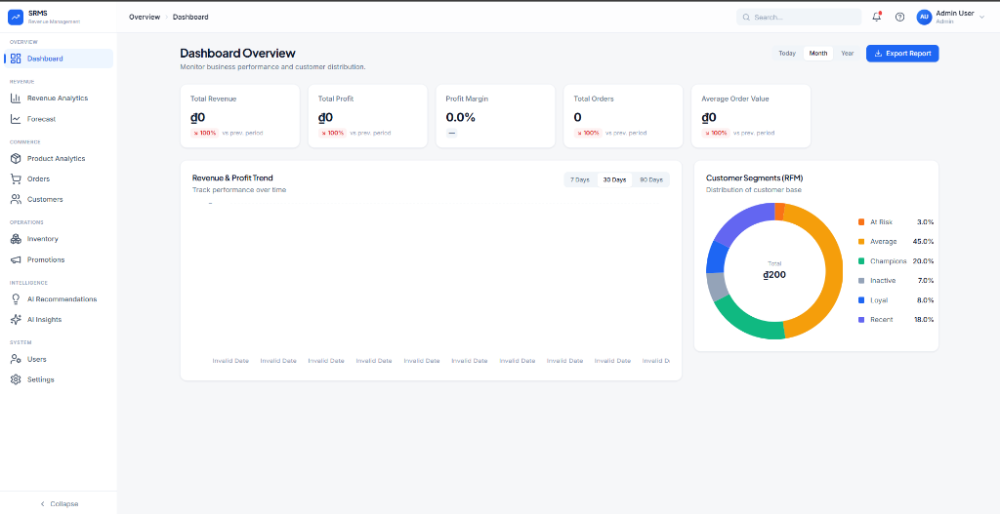
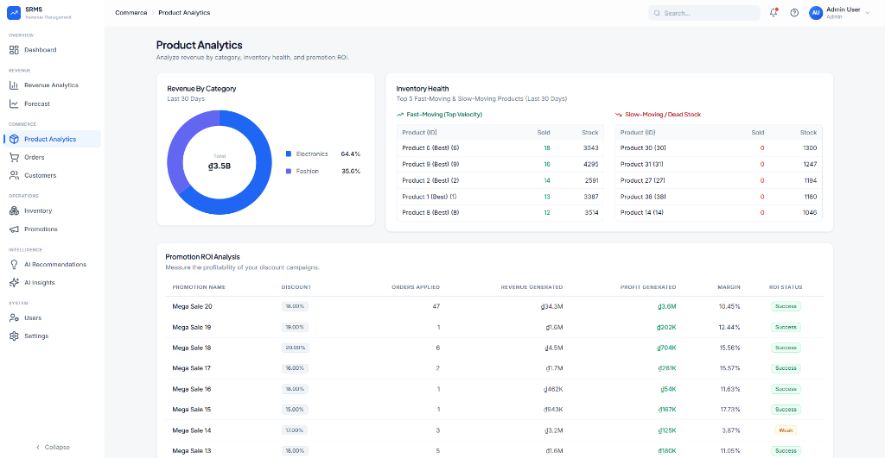
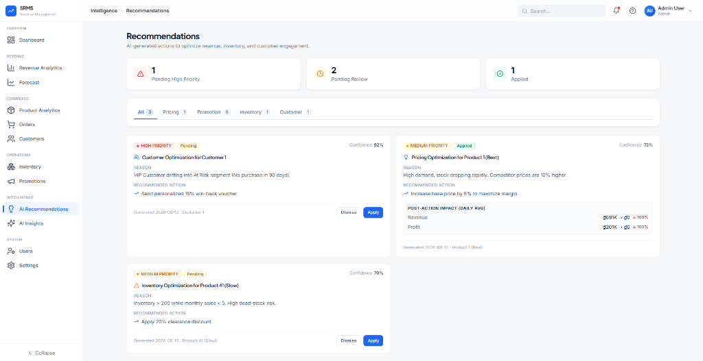

# SRMS — Smart Revenue Management System

> Hệ thống quản lý và tối ưu doanh thu thông minh dành cho SME/E-commerce, biến dữ liệu bán hàng thô thành đề xuất hành động cụ thể cho nhà quản lý.


---

## Mục lục

- [Vấn đề & Mục tiêu](#vấn-đề--mục-tiêu)
- [Tính năng chính](#tính-năng-chính)
- [Kiến trúc hệ thống](#kiến-trúc-hệ-thống)
- [Tech Stack](#tech-stack)
- [Phân quyền người dùng](#phân-quyền-người-dùng)
- [Cài đặt & Chạy dự án](#cài-đặt--chạy-dự-án)
- [Cấu trúc thư mục](#cấu-trúc-thư-mục)
- [Business Rules nổi bật](#business-rules-nổi-bật)
- [Điểm khác biệt so với BI Tools thông thường](#điểm-khác-biệt-so-với-bi-tools-thông-thường)
- [Ảnh chụp màn hình](#ảnh-chụp-màn-hình)
- [Tác giả](#tác-giả)

---

## Vấn đề & Mục tiêu

Doanh nghiệp bán lẻ/E-commerce quy mô nhỏ thường có rất nhiều dữ liệu bán hàng nhưng khó khai thác: không biết sản phẩm nào thực sự sinh lời, khách hàng nào đáng giữ chân, khuyến mãi nào lãi thật hay chỉ tăng doanh thu ảo, hàng nào đang tồn đọng cần xử lý.

SRMS được xây dựng để giải quyết chuỗi vấn đề đó theo đúng quy trình:

```
Dữ liệu bán hàng → Phân tích (Analytics) → Insight → Đề xuất (Recommendation) → Hành động của Manager → Đo lường hiệu quả
```

Điểm quan trọng: hệ thống không dừng lại ở việc **hiển thị** báo cáo, mà **chủ động đề xuất hành động** dựa trên rule/thống kê thực tế, và có khả năng **đo lường lại hiệu quả** sau khi hành động được áp dụng — đóng kín vòng lặp ra quyết định.

---

## Tính năng chính

### 📊 Revenue Dashboard
KPI tổng quan (Revenue, Profit, Margin, Orders, AOV) với so sánh tăng trưởng theo kỳ (Today/Month/Year), biểu đồ xu hướng doanh thu/lợi nhuận theo khung thời gian tùy chỉnh (7/30/90 ngày).

### 🧩 Product Analytics
Phân tích doanh thu theo danh mục, phát hiện sản phẩm bán chạy (Fast-moving) và tồn kho lâu ngày (Slow-moving/Dead-stock), đánh giá **ROI thực tế của từng chương trình khuyến mãi** — trả lời câu hỏi "khuyến mãi này có thực sự sinh lời hay chỉ tăng doanh thu ảo".

### 👥 Customer Analytics — RFM Segmentation
Phân khúc khách hàng tự động theo mô hình RFM (Recency, Frequency, Monetary): Champions, Loyal, At Risk, Lost, Recent, Inactive. Nhãn VIP được suy ra trực tiếp từ kết quả RFM, không phải rule tính riêng.

### 📦 Inventory Management
Theo dõi tồn kho theo tốc độ bán hàng thực tế (sales velocity), phân loại rủi ro (Critical/High/Medium/Low) dựa trên cả mức tồn kho lẫn tốc độ luân chuyển — không chỉ đơn thuần đếm số lượng. Hỗ trợ nhập/xuất/điều chỉnh kho với audit trail đầy đủ.

### 🤖 AI Recommendation Engine
Tự động sinh đề xuất hành động (đổi giá, tạo khuyến mãi, nhập hàng, chăm sóc khách hàng) dựa trên rule-based analysis, kèm lý do (Reason) và mức độ ưu tiên (Priority) tính động theo dữ liệu thực tế. Cho phép Manager **Apply** để hệ thống tự thực thi hành động (ví dụ tự động cập nhật giá + ghi lịch sử), hoặc **Dismiss** nếu không phù hợp.

### 📈 Post-Action Impact Analysis
Sau khi một đề xuất về giá được áp dụng, hệ thống tự động đo lường và so sánh doanh thu/lợi nhuận trung bình mỗi ngày **trước và sau** thời điểm áp dụng — đóng vòng lặp "đề xuất → hành động → đo lường hiệu quả".

---

## Kiến trúc hệ thống

```
┌─────────────────┐        REST API (JSON)        ┌──────────────────┐
│   Frontend       │  ─────────────────────────►   │   Backend        │
│   React + Vite   │  ◄─────────────────────────   │   Laravel        │
│   (port 5173)    │      Bearer Token Auth         │   (port 8000)    │
└─────────────────┘                                 └────────┬─────────┘
                                                              │
                                                              ▼
                                                     ┌──────────────────┐
                                                     │   MySQL Database  │
                                                     │   (18+ tables)    │
                                                     └──────────────────┘
```

---

## Tech Stack

| Layer | Công nghệ |
|---|---|
| Frontend | React, Vite, TypeScript, Tailwind CSS, Recharts |
| Backend | Laravel (REST API) |
| Auth | Laravel Sanctum (Bearer Token) |
| Database | MySQL 8.0+ |
| Dev Environment | Laragon (PHP + MySQL + Apache) |

---

## Phân quyền người dùng

| Vai trò | Quyền hạn chính |
|---|---|
| **Admin** | Toàn quyền: quản lý người dùng, sản phẩm, danh mục, đơn hàng, tồn kho, giá, khuyến mãi, xem toàn bộ báo cáo/AI Insights |
| **Manager** | Xem Dashboard/Analytics/Forecast/AI Insights, tạo khuyến mãi, đổi giá, áp dụng/từ chối đề xuất AI |
| **Staff** | Xem sản phẩm, tạo đơn hàng, cập nhật trạng thái đơn (trừ Hủy/Hoàn tiền), xem tồn kho và thông tin khách hàng |

---

## Cài đặt & Chạy dự án

### Yêu cầu môi trường
- PHP >= 8.3, Composer
- Node.js >= 18, npm
- MySQL >= 8.0

### Backend (Laravel)

```bash
cd backend
composer install
cp .env.example .env
php artisan key:generate
# Cấu hình DB_* trong .env theo môi trường của bạn
php artisan migrate --seed
php artisan serve
```

### Frontend (React)

```bash
cd project
npm install
npm run dev
```

Truy cập ứng dụng tại `http://localhost:5173`.

**Tài khoản mặc định sau khi seed:**
| Vai trò | Email | Mật khẩu |
|---|---|---|
| Admin | admin@srms.com | password |
| Manager | manager@srms.com | password |
| Staff | staff1@srms.com | password |

---

## Cấu trúc thư mục

```
SRMS/
├── backend/                 # Laravel REST API
│   ├── app/Http/Controllers/
│   ├── database/migrations/
│   ├── database/seeders/
│   └── routes/api.php
├── project/                 # React SPA
│   ├── src/pages/
│   ├── src/components/
│   └── src/services/
└── schema.sql                # Tài liệu đối chiếu cấu trúc database
```

---

## Business Rules nổi bật

- **BR01**: Chỉ đơn hàng có `status = Completed` mới được ghi nhận vào Revenue.
- **BR02**: Khi đơn hàng hoàn tất, tồn kho tự động bị trừ tương ứng.
- **BR06**: `Profit Margin = Profit / Selling Price × 100%`, tính theo giá bán **hiện tại**, không phải giá niêm yết gốc.
- **BR07**: Không cho phép đặt giá bán thấp hơn giá vốn — áp dụng nhất quán cho cả luồng đổi giá thủ công lẫn tự động qua Recommendation Engine.
- **VIP Rule**: Nhãn VIP được suy ra từ kết quả phân khúc RFM (Champions hoặc Loyal có Monetary cao), không phải một rule chi tiêu độc lập.

---

## Điểm khác biệt so với BI Tools thông thường

Các công cụ BI phổ biến (Power BI, Tableau...) giúp trực quan hóa và giải thích dữ liệu, nhưng dừng lại ở đó — người dùng vẫn phải tự phát hiện vấn đề và tự thực hiện hành động ở một hệ thống khác.

SRMS đóng thêm 2 lớp mà BI tool thuần túy không có:
1. **Chủ động phát hiện & đề xuất**: hệ thống tự quét dữ liệu và đẩy cảnh báo/đề xuất, không cần người dùng tự tìm.
2. **Đóng vòng lặp hành động — đo lường**: vì hệ thống sở hữu cả tầng giao dịch, sau khi một đề xuất được áp dụng, nó có thể tự động đo lại hiệu quả thực tế của chính hành động đó.

---

## Ảnh chụp màn hình






---

## Tác giả

**Nguyễn Như Trung**
Dự án được phát triển như đồ án học phần Lập trình Web, đồng thời sử dụng làm portfolio project cho các vị trí Business Analyst / BI Analyst / Product Analyst.
