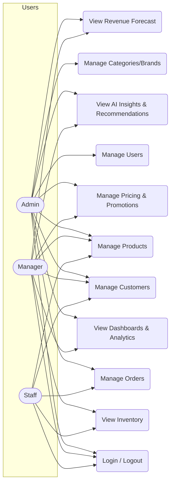
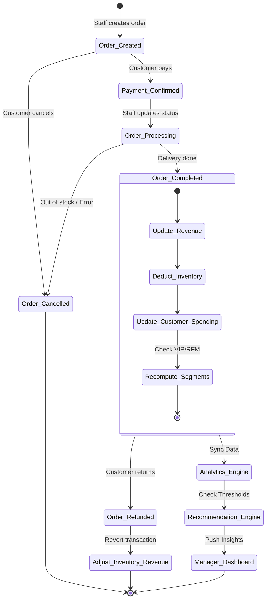
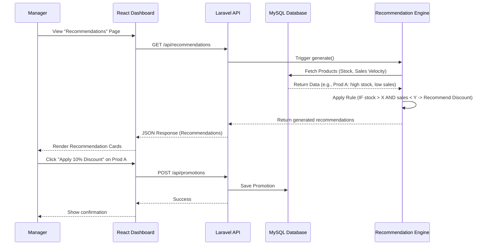

# SRMS - Business & System Analysis (Phase 1 & 2)

## PHASE 1: BUSINESS ANALYSIS

### 1.1 Business Problem
Doanh nghiệp (SME/E-commerce) sở hữu nhiều dữ liệu bán hàng (đơn hàng, khách hàng, sản phẩm) nhưng gặp khó khăn trong việc phân tích và tận dụng dữ liệu này. Cụ thể:
- Khó xác định chính xác sản phẩm nào mang lại doanh thu chính, sản phẩm nào đóng góp lợi nhuận cao nhất.
- Không phân loại được tập khách hàng có giá trị cao để chăm sóc và giữ chân.
- Khó đánh giá hiệu quả thực sự của các chương trình khuyến mãi (Promotion) - liệu chúng mang lại lợi nhuận hay chỉ tăng trưởng doanh thu ảo.
- Không nhận biết kịp thời các sản phẩm tồn kho lâu ngày (dead stock) hoặc sản phẩm sắp hết hàng (low stock) để ra quyết định nhập hàng/giảm giá.
- Thiếu công cụ tự động đề xuất các hành động kinh doanh (Business Recommendations) dựa trên dữ liệu.

### 1.2 Business Objectives
- **Increase revenue**: Tăng trưởng doanh thu thông qua việc tập trung vào sản phẩm bán chạy và khách hàng tiềm năng.
- **Increase profit margin**: Tối ưu hóa lợi nhuận bằng cách phân tích cơ cấu giá, chi phí và hiệu quả khuyến mãi.
- **Reduce dead stock**: Giảm thiểu hàng tồn kho không luân chuyển thông qua các đề xuất giảm giá/khuyến mãi xả hàng.
- **Improve promotion effectiveness**: Đảm bảo các chương trình khuyến mãi tạo ra ROI dương.
- **Improve customer retention**: Giữ chân khách hàng thông qua việc phân nhóm (RFM) và chăm sóc cá nhân hóa (khuyến mãi riêng cho nhóm At Risk, VIP).

### 1.3 Stakeholder Analysis
- **Business Owner**: Người quan tâm đến tổng thể sức khỏe tài chính của doanh nghiệp (Revenue, Profit, ROI).
- **Manager**: Người sử dụng hệ thống hàng ngày để xem Analytics Dashboard, nhận Insights, Recommendations và đưa ra quyết định (giá cả, nhập hàng, khuyến mãi).
- **Admin**: Người quản trị cấu hình hệ thống, cấp quyền người dùng, dọn dẹp dữ liệu.
- **Sales/Staff**: Nhân viên thực hiện các nghiệp vụ hằng ngày như tạo đơn hàng, cập nhật trạng thái đơn, kiểm tra tồn kho, xem thông tin khách hàng.
- **Customer**: Khách hàng mua sắm, đối tượng chịu tác động trực tiếp của các chiến lược giá và chương trình khuyến mãi.

### 1.4 Business Process (AS-IS vs TO-BE)
#### AS-IS Process (Hiện tại)
1. Khách hàng đặt hàng -> Nhân viên tạo đơn hàng trên phần mềm bán hàng thông thường.
2. Cuối tháng, Manager xuất file Excel doanh thu, tồn kho.
3. Manager dùng hàm Excel để lọc sản phẩm tồn nhiều, tính tổng doanh thu.
4. Ra quyết định thủ công về việc chạy khuyến mãi dựa trên cảm tính hoặc dữ liệu quá khứ không đầy đủ.
5. Thiếu phân tích lợi nhuận thực tế sau khi trừ chi phí (Cost) và khuyến mãi (Discount).

#### TO-BE Process (Quy trình mới với SRMS)
1. Đơn hàng phát sinh -> Hệ thống ghi nhận.
2. Khi trạng thái đơn = `Completed`: Hệ thống tự động cập nhật doanh thu, trừ tồn kho, cộng dồn chi tiêu của khách hàng.
3. Dữ liệu lập tức chảy vào **Analytics Engine**.
4. **Recommendation Engine** tự động quét dữ liệu định kỳ (hoặc realtime) để phát hiện bất thường:
   - *Hàng A ế, tồn nhiều -> Báo Manager: Đề xuất giảm giá 10%.*
   - *Khách B đã 85 ngày chưa mua hàng -> Báo Manager: Đề xuất gửi voucher 15%.*
5. Manager mở Dashboard -> Đọc AI Insights -> Duyệt Recommendation -> Bấm tạo Promotion/Đổi giá với 1 click.

### 1.5 Business Rules
- **BR01 — Revenue**: Chỉ đơn hàng có `status = Completed` mới được ghi nhận vào Doanh thu.
- **BR02 — Inventory Deduction**: Tồn kho (`Stock`) bị trừ khi `status = Completed` (hoặc Processing tùy quy trình, ở đây chốt khi Completed).
- **BR03 — Low Stock Alert**: `IF Stock < Reorder Level -> Alert: Low Stock`.
- **BR04 — Out of Stock**: `IF Stock = 0 -> Status: Out of Stock`.
- **BR05 — Profit Calculation**: `Profit = Selling Price - Cost Price - Discount Amount`.
- **BR06 — Profit Margin**: `Margin = (Profit / Selling Price) * 100%`.
- **BR07 — VIP Customer**: Nhãn VIP được suy ra từ kết quả phân khúc RFM (ví dụ: RFM segment là Champions hoặc Loyal + Monetary cao) để hiển thị trên UI.
- **BR08 — Promotion Validity**: Promotion chỉ có hiệu lực khi `StartDate <= CurrentDate <= EndDate`.
- **BR09 — Price Recommendation**: `Recommended Price >= Cost Price` (Không bao giờ bán lỗ trừ khi có flag xả hàng đặc biệt).
- **BR10 — Order Refund**: Khi đơn bị Refund -> `Revenue -= Order Revenue`, `Inventory += Returned Quantity`.

---

## PHASE 2: SYSTEM ANALYSIS

### 2.1 Actors
1. **Admin**: Toàn quyền cấu hình hệ thống, CRUD Users, Categories, Brands.
2. **Manager**: Tập trung xem Dashboard, Analytics, AI Insights, Recommendations. Có quyền tạo Promotion, đổi Price.
3. **Staff**: Tập trung vào Sales (CRUD Orders, Customers), View Inventory, View Products. Không được sửa cấu hình/phân tích.

### 2.2 Functional Requirements (FR)
- **FR01 - Auth**: Đăng nhập, đăng xuất, phân quyền (Admin/Manager/Staff).
- **FR02 - Product Mgt**: CRUD Sản phẩm, Danh mục, Thương hiệu, Nhà cung cấp. Định giá (Cost, Selling price).
- **FR03 - Customer Mgt**: CRUD Khách hàng. Tự động tính RFM và phân nhóm khách hàng.
- **FR04 - Order Mgt**: CRUD Đơn hàng. Cập nhật trạng thái (Pending -> Completed/Refunded).
- **FR05 - Inventory Mgt**: Theo dõi tồn kho. Cảnh báo Low stock, Out of stock.
- **FR06 - Pricing & Promotion**: Thay đổi giá, lưu lịch sử giá. Tạo/Quản lý Promotion. Đánh giá ROI của Promotion.
- **FR07 - Analytics Dashboards**: Biểu đồ doanh thu (ngày/tháng/danh mục/sản phẩm), phân tích sản phẩm, phân tích khách hàng.
- **FR08 - Forecasting**: Dự báo doanh thu 7-30 ngày tới (Linear Regression / Moving Average).
- **FR09 - Recommendation Engine**: Đưa ra đề xuất về Giá, Khuyến mãi, Tồn kho, Khách hàng.
- **FR10 - AI Insights**: Sinh text tự động tóm tắt tình hình kinh doanh hiện tại và các cảnh báo rủi ro.

### 2.3 Non-Functional Requirements (NFR)
- **NFR01 - Security**: Mật khẩu phải được hash (Bcrypt). API phải bảo vệ bằng JWT hoặc Session Cookie. Chống SQL Injection, XSS.
- **NFR02 - Performance**: Dashboard phải load nhanh (<= 2 giây). Các câu query phân tích (GROUP BY, SUM) phải được đánh index.
- **NFR03 - Usability**: UI/UX theo hướng SPA (Single Page Application) sử dụng React, trải nghiệm mượt mà, responsive trên Desktop/Tablet.
- **NFR04 - Architecture**: Backend Laravel (REST API) tách biệt hoàn toàn với Frontend React.
- **NFR05 - Availability**: Hệ thống cần đảm bảo thời gian hoạt động (uptime) cao (ví dụ: 99.9%) để không làm gián đoạn quá trình bán hàng và phân tích.
- **NFR06 - Maintainability**: Codebase được viết theo chuẩn (PSR cho PHP, ESLint cho JS), tổ chức component rõ ràng để dễ dàng bảo trì và mở rộng trong tương lai.

### 2.4 Use Case Diagram

### 2.5 Activity Diagram: Process Order & Analytics Update

### 2.6 Sequence Diagram: Recommendation Flow

