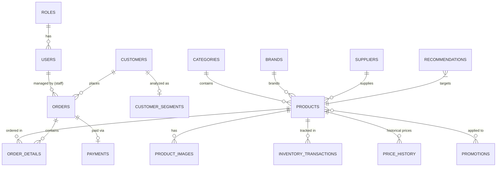

# SRMS - Database Design (Phase 3)

Tài liệu này định nghĩa cấu trúc cơ sở dữ liệu (Database Schema) và các mối quan hệ (Relationships) cho hệ thống Smart Revenue Management System (SRMS).

## 1. Entity-Relationship Diagram (ERD)

Sơ đồ ERD khái quát các thực thể chính trong hệ thống và mối quan hệ giữa chúng:

## 2. Table Definitions

Dưới đây là chi tiết các bảng, kiểu dữ liệu và mô tả. (Lưu ý: Tất cả các bảng đều mặc định có `created_at` và `updated_at`).

### 2.1. Quản lý Người dùng & Khách hàng
* **roles**: Định nghĩa quyền (`Admin`, `Manager`, `Staff`).
  * `id` (PK)
  * `name` (VARCHAR, e.g., 'admin', 'manager', 'staff')
* **users**: Tài khoản nhân sự hệ thống.
  * `id` (PK)
  * `role_id` (FK -> roles)
  * `name`, `email`, `password`, `status`
* **customers**: Hồ sơ khách hàng mua sắm.
  * `id` (PK)
  * `name`, `email`, `phone`, `address`
  * `total_spending` (DECIMAL) - Dùng cho tính Monetary
  * `total_orders` (INT) - Dùng cho tính Frequency
  * `last_purchase_date` (DATETIME) - Dùng cho tính Recency
* **customer_segments**: Lưu trữ kết quả phân tích RFM của khách hàng.
  * `id` (PK)
  * `customer_id` (FK -> customers)
  * `r_score`, `f_score`, `m_score` (TINYINT: 1-5)
  * `segment_name` (VARCHAR: 'Champions', 'Loyal', 'At Risk'...)
  * `is_vip` (BOOLEAN) - Flag suy ra từ segment
  * `calculated_at` (DATETIME)

### 2.2. Quản lý Sản phẩm
* **categories**: Danh mục.
  * `id` (PK)
  * `parent_id` (FK -> categories) - Hỗ trợ danh mục đa cấp.
  * `name`
* **brands**: Thương hiệu.
  * `id` (PK)
  * `name`
* **suppliers**: Nhà cung cấp.
  * `id` (PK)
  * `name`, `contact_info`
* **products**: Bảng cốt lõi của sản phẩm.
  * `id` (PK)
  * `category_id`, `brand_id`, `supplier_id` (FKs)
  * `name`, `sku` (UNIQUE)
  * `cost_price` (DECIMAL) - Giá vốn (Dùng để tính lợi nhuận)
  * `base_price` (DECIMAL) - Giá niêm yết
  * `current_price` (DECIMAL) - Giá bán hiện tại
  * `stock_quantity` (INT)
  * `reorder_level` (INT) - Mức tồn kho tối thiểu cần nhập thêm
  * `status` (VARCHAR: 'Active', 'Inactive', 'Out of Stock')
* **product_images**:
  * `id` (PK)
  * `product_id` (FK)
  * `image_url`
  * `is_primary` (BOOLEAN)

### 2.3. Quản lý Tồn kho & Giá
* **inventory_transactions**: Lịch sử xuất/nhập kho (nhằm phục vụ báo cáo dead stock / fast-moving).
  * `id` (PK)
  * `product_id` (FK)
  * `type` (ENUM: 'IN', 'OUT', 'ADJUSTMENT')
  * `quantity` (INT)
  * `reference_type` (ENUM: 'order', 'purchase', 'adjustment') - Phân loại reference
  * `reference_id` (Mã đơn hàng hoặc mã phiếu nhập, đa hình)
* **price_history**: Lịch sử đổi giá (để Analytics đánh giá tác động của giá tới doanh số).
  * `id` (PK)
  * `product_id` (FK)
  * `old_price`, `new_price` (DECIMAL)
  * `changed_by` (FK -> users)

### 2.4. Quản lý Đơn hàng & Thanh toán
* **orders**:
  * `id` (PK)
  * `customer_id` (FK)
  * `staff_id` (FK -> users) - Người tạo/xử lý đơn
  * `total_amount` (DECIMAL) - Tổng trước giảm giá
  * `discount_amount` (DECIMAL) - Khuyến mãi áp dụng
  * `final_amount` (DECIMAL) - Khách phải trả
  * `status` (ENUM: 'Pending', 'Confirmed', 'Processing', 'Completed', 'Cancelled', 'Refunded')
* **order_details**: Dữ liệu chi tiết, "đóng băng" giá và chi phí tại thời điểm mua.
  * `id` (PK)
  * `order_id` (FK), `product_id` (FK)
  * `promotion_id` (FK, Nullable) - Lưu lại mã khuyến mãi nếu áp dụng
  * `quantity` (INT)
  * `unit_price` (DECIMAL) - Giá bán lúc mua (trước khuyến mãi)
  * `cost_price` (DECIMAL) - Giá vốn lúc mua (Bắt buộc để tính profit không bị sai nếu cost sau này đổi)
  * `discount_amount` (DECIMAL) - Số tiền được giảm cho từng sản phẩm này
  * `total` (DECIMAL) - Tính bằng: (unit_price * quantity) - discount_amount
  * `profit` (DECIMAL) - Tính sẵn: total - (cost_price * quantity)
* **payments**:
  * `id` (PK)
  * `order_id` (FK)
  * `payment_method` (VARCHAR)
  * `status` (ENUM: 'Unpaid', 'Paid', 'Refunded')

### 2.5. Quản lý Khuyến mãi
* **promotions**:
  * `id` (PK)
  * `name`
  * `discount_type` (ENUM: 'PERCENT', 'FIXED')
  * `discount_value` (DECIMAL)
  * `start_date`, `end_date` (DATETIME)
  * `min_order_value` (DECIMAL)
  * `status` (ENUM: 'Active', 'Expired', 'Draft')
* **promotion_products**: Bảng trung gian (N-N) cho biết promotion áp dụng cho sản phẩm nào.
  * `promotion_id` (FK)
  * `product_id` (FK)

### 2.6. Phân tích & AI Recommendation
* **revenue_daily** (Data Warehouse thu gọn): Bảng aggregate chạy cronjob hằng ngày để Dashboard load nhanh mà không cần SUM hàng triệu orders.
  * `date` (DATE, PK)
  * `total_revenue`, `total_profit`, `total_orders` (DECIMAL/INT)
* **forecast_results** (Optional, dùng cho Phase 10): Bảng lưu kết quả dự báo doanh thu.
  * `id` (PK)
  * `target_date` (DATE) - Ngày được dự báo
  * `expected_revenue` (DECIMAL)
  * `lower_bound`, `upper_bound` (DECIMAL) - Khoảng tin cậy nếu có
  * `model_used` (VARCHAR)
  * `created_at` (DATETIME)
* **recommendations**: Bảng lưu các đề xuất hệ thống sinh ra.
  * `id` (PK)
  * `type` (ENUM: 'Pricing', 'Promotion', 'Inventory', 'Customer')
  * `target_type` (ENUM: 'product', 'customer') - Bắt buộc để tránh nhầm ID đa hình
  * `target_id` (ID của Product hoặc Customer)
  * `reason` (TEXT: ví dụ "Stock high, sales low")
  * `recommended_action` (TEXT: ví dụ "Reduce price by 10%")
  * `status` (ENUM: 'Pending', 'Applied', 'Rejected')

## 3. SQL Schema & Sample Data Plan
- Thay vì cung cấp 1 file `.sql` thô khổng lồ, theo chuẩn của **Laravel (đã chốt ở Phase 1)**, toàn bộ cấu trúc bảng này sẽ được chuyển hóa thành các file **Migrations**.
- Dữ liệu mẫu (100 customers, 50 products, 500 orders...) cũng sẽ được tạo tự động thông qua **Laravel Factories & Seeders** ở Phase 5. Việc dùng Seeder giúp chúng ta dễ dàng tạo dữ liệu ngẫu nhiên có tính logic (ngày mua rải rác trong 1 năm, có mùa cao/thấp điểm) hơn là viết insert SQL tay cứng nhắc.
- *Tuy nhiên, nếu bạn yêu cầu phải có 1 file `schema.sql` thuần ngay tại Phase 3 để chấm điểm Database Design trước khi code, tôi sẽ cung cấp thêm một file `schema.sql`.*
